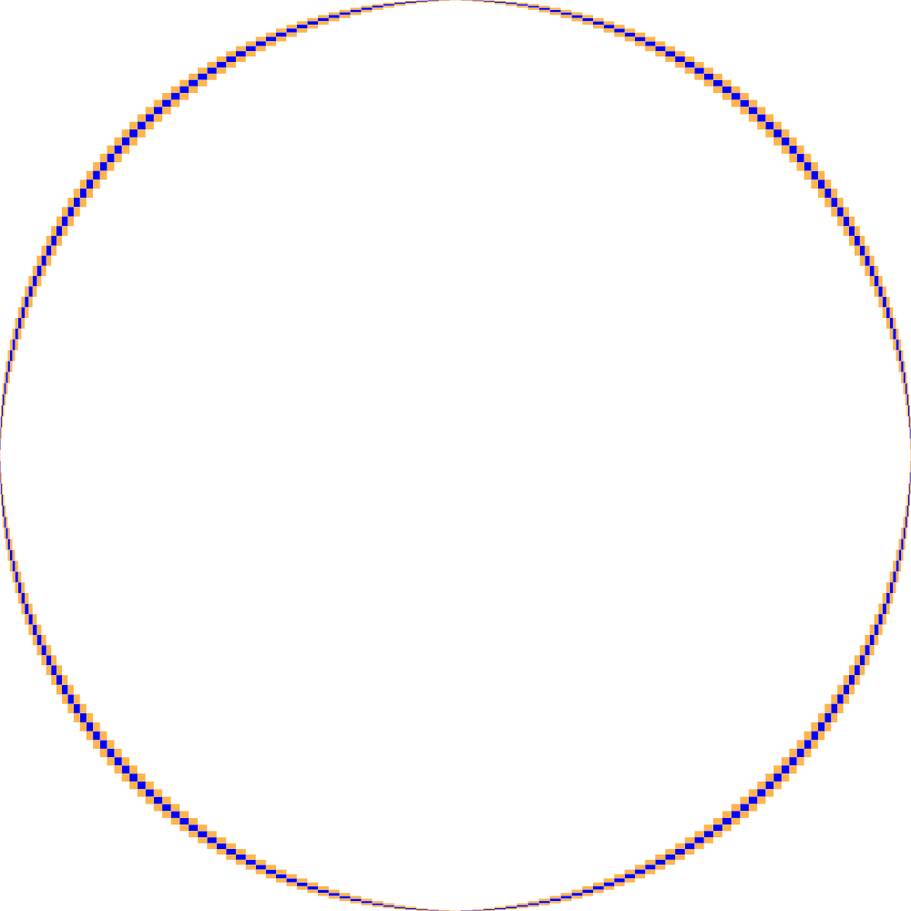

# Fast curve visualization


Visualization of an implicit curve defined by a bivariate polynomial on the square $[-1,1] \times [-1,1]$ with a given resolution $n$.
<p align="center">
  
</p>

The main implementation is based on multipoint evaluation and subdivision.

It returns a image composed of pixels, each made of one of three colors:
- **white** if the curve does not cross the pixel,
- **blue** if the curve does cross the pixel,
- **orange** if it is undecided.

These colors are arbitrarily chosen for visual clarity. One can also have the image in white, black and red as in [ImplicitEquations](https://github.com/jverzani/ImplicitEquations.jl) by setting an option.

## Prerequisites

### Some standard Python packages

- `matplotlib`
- `scipy`

### Some non-standard Python packages

- `flint-py` (available for python <= 3.8 with pip for now (October 2023))
- `codetiming`
- `pyinterval`

**Note that it is `flint-py`, not `python-flint`.**

Not used currently:
- `binarytree`
<!-- - `vispy` ([here](https://vispy.org/installation.html))
- `numba` (requires `llvmlite` and thus `llvm-10` or `llvm-9`)

### Third-party program (not used currently)

Download the binary file corresponding to your platform from [ANewDsc's website](http://anewdsc.mpi-inf.mpg.de/).\
Rename `test_descartes_os64` as `test_descartes` or use a symbolic link. Add the directory in which `test_descartes` is to your PATH, if it is not already the case. -->

## Running the program

Here are some examples of commands to use the code.

### Guaranting algorithm: pixel enclosure (main algorithm)

Basic use for $n=64$ (the default input returns a circle):

```
python3 certipixel.py 64
```

Using another polynomial, with another resolution:

```
python3 certipixel.py 512 -poly ../polys/random_10.poly
```

Not showing the interactive display, but saving the visualization in a `.pdf` file:

```
python3 certipixel.py 512 -poly ../polys/random_10.poly -hide -save
```
The image is saved in the `output/` folder.

### Approximating algorithm: edge enclosure

Using subdivision (nothing to do):

```
python3 main.py 64
```

Using Taylor approximation:

```
python3 main.py 64 -taylor
```

### Help

For additional information use:

```
python3 certipixel.py --help
```

## Input format

The polynomials are stored as tables of coefficients.

For example, the polynomial $\sum_{i,j \in [0,2]} a_{i,j} X^i Y^j$ would be stored in a file as follows.

$a_{0,0} \quad a_{0,1} \quad a_{0,2}$

$a_{1,0} \quad a_{1,1} \quad a_{1,2}$

$a_{2,0} \quad a_{2,1} \quad a_{2,2}$

For instance, the unit circle is defined by $P(X,Y) = X^2 + Y^2 - 1$. So the coefficients are stored as follows.

$-1 \quad 0 \quad 1$

$~~~0 \quad 0 \quad 0$

$~~~1 \quad 0 \quad 0$

That is what the default input file [`unit_circle.poly`](polys/unit_circle.poly) contains.

## Benchmarking

The `benchmarking/timing.sh` file creates timing tables in `.tsv` files inside the `benchmarking/output/` folder. It allows to compare these implementations, MATLAB, Julia and scikit.

Some parts of the code are meant for personal use.

## Logging

Some information is logged for `certipixel.py` and `main.py`:
- the time for the two steps of the algorithms respectively in `certi_time.log` and `main_time.log`,
- the number of pixels of each color respectively in `certi_piexl_ratio.log` and `main_pixel_ratio.log`.


## Remark

Use the `-save` option instead of saving from the interactive display from Matplotlib. Indeed, that allows to get an vectorized image saved in a `.pdf` file. Matplotlib saves a rasterized `.png` image.